# Avalonia.One

<div align="center">
  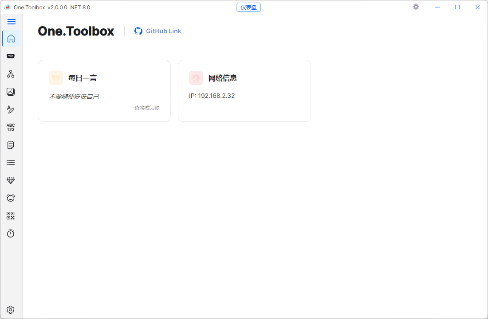
  
  <h3>✨ 现代化跨平台桌面工具箱</h3>
  <p>基于 Avalonia 框架开发的轻量级、模块化桌面工具集合，为开发者和技术人员提供一站式解决方案</p>
  
  <div>
    
    
    
    
  </div>
</div>

## 📋 目录

- [项目概述](#-项目概述)
- [架构说明](#-架构说明)
  - [系统模块划分](#系统模块划分)
  - [核心技术栈](#核心技术栈)
- [功能特性](#-功能特性)
  - [串口调试工具](#串口调试工具)
  - [网络工具](#网络工具)
  - [数据处理工具](#数据处理工具)
  - [差异比较工具](#差异比较工具)
  - [笔记管理](#笔记管理)
  - [待办事项](#待办事项)
  - [哈希工具](#哈希工具)
  - [正则表达式测试](#正则表达式测试)
  - [二维码生成](#二维码生成)
  - [Unix时间转换](#unix时间转换)
  - [Bing图片浏览](#bing图片浏览)
- [项目优势](#-项目优势)
- [快速开始](#-快速开始)
  - [本地构建](#本地构建)
  - [运行测试](#运行测试)
  - [发布](#发布)
- [贡献指南](#-贡献指南)
- [作者信息](#-作者信息)

## 🎯 项目概述

Avalonia.One 是一款基于 Avalonia 框架开发的现代化跨平台桌面工具箱，旨在将开发与调试过程中最常用的小工具集中在一个轻量级应用中，减少用户在多个独立工具之间来回切换的成本。

### 核心功能
- 串口通信与调试
- 网络工具集
- 数据格式转换与处理
- 文本差异比较
- 个人笔记管理
- 待办事项跟踪
- 哈希值计算
- 正则表达式测试
- 二维码生成与识别
- Unix时间戳转换
- Bing每日图片浏览

### 应用场景
- 软件开发与调试
- 硬件设备通信测试
- 数据格式转换与验证
- 文本内容比较与分析
- 日常学习与工作记录
- 网络配置与测试

### 目标用户
- 软件开发者与测试工程师
- 硬件开发与嵌入式系统工程师
- 数据分析师与处理人员
- 技术爱好者与学习者

## 🏗️ 架构说明

### 系统模块划分

Avalonia.One 采用模块化设计，各模块职责明确，耦合度低，便于扩展和维护：

| 模块名称 | 主要职责 |
|---------|---------|
| `One.Base` | 纯逻辑与基础能力库，包含扩展方法、加密、网络、数据处理等核心功能 |
| `One.Control` | 自定义控件与标记扩展，提供统一的UI组件库 |
| `One.SimpleLog` | 轻量级日志组件，支持多级别日志记录 |
| `One.Toolbox` | 桌面应用主体，包含所有工具页面和核心业务逻辑 |
| `One.Toolbox.Desktop` | 应用打包与发布项目，负责多平台部署 |
| `One.Base.Tests` | `One.Base` 模块的单元测试项目 |

### 核心技术栈

| 技术/框架 | 版本 | 用途 |
|----------|------|------|
| .NET | 8.0 | 核心开发框架 |
| Avalonia | 11.3.12 | 跨平台UI框架 |
| MVVM Toolkit | 8.2.0 | MVVM架构实现 |
| Microsoft.Extensions.DependencyInjection | 8.0.0 | 依赖注入容器 |
| Newtonsoft.Json | 13.0.3 | JSON序列化与反序列化 |

## 🚀 功能特性

### 串口调试工具
**功能说明：** 提供专业的串口通信与调试功能，支持多种波特率和数据格式。

**核心功能点：**
- 自动枚举可用串口设备
- 支持多种波特率、数据位、停止位和校验位配置
- 实时数据收发与显示
- 支持十六进制/ASCII模式切换
- 定时发送功能
- 数据记录与导出

**界面截图：**

<div align="center">
  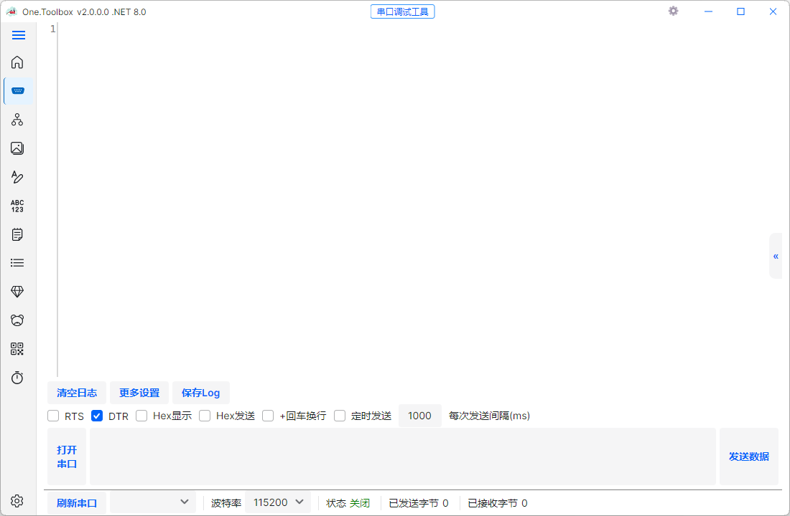
  <p>串口调试工具界面</p>
</div>

### 网络工具
**功能说明：** 集成常用网络工具，方便网络配置与测试。

**核心功能点：**
- IP地址查询与验证
- 端口扫描功能
- 网络连接测试
- 网络信息查看

**界面截图：**

<div align="center">
  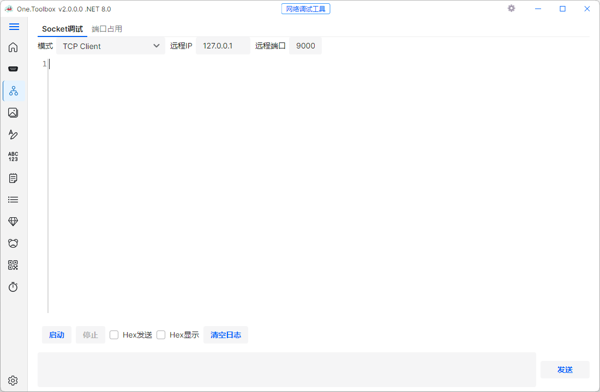
  <p>网络工具界面</p>
</div>

### 数据处理工具
**功能说明：** 提供多种数据格式转换与处理功能。

**核心功能点：**
- JSON格式化与验证
- Base64编码/解码
- URL编码/解码
- 文本转义与反转义
- 大小写转换

**界面截图：**

<div align="center">
  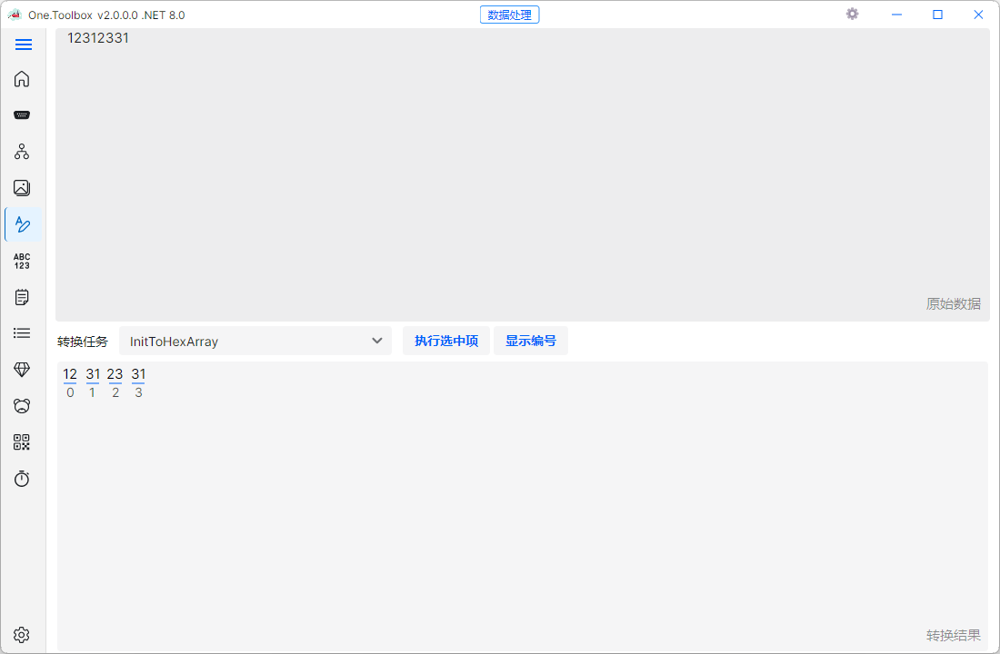
  <p>数据处理工具界面</p>
</div>

### 差异比较工具
**功能说明：** 比较两个文本内容的差异，支持代码高亮显示。

**核心功能点：**
- 文本差异可视化比较
- 支持行内差异高亮
- 差异统计与导航
- 支持多种文本格式

**界面截图：**

<div align="center">
  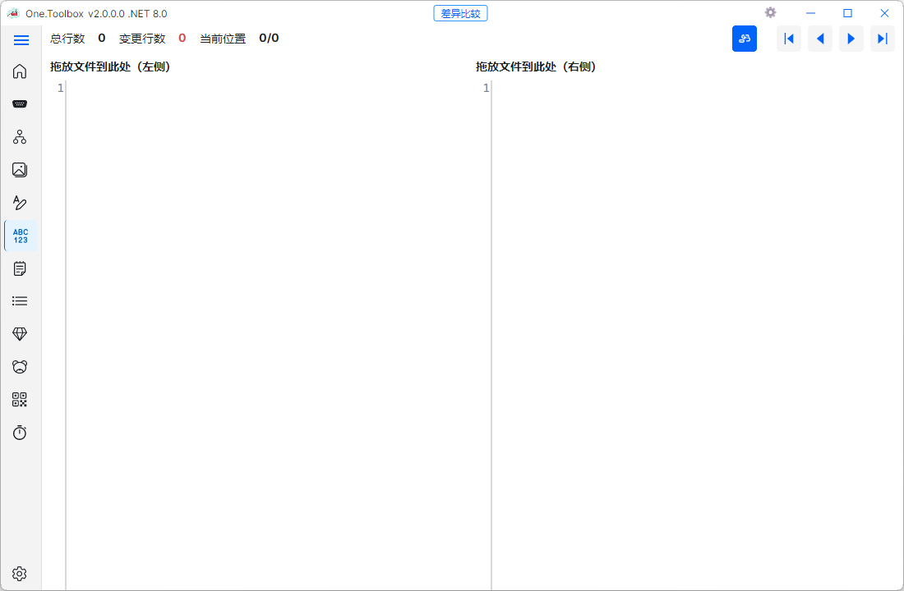
  <p>差异比较工具界面</p>
</div>

### 笔记管理
**功能说明：** 个人笔记管理工具，支持富文本编辑和分类管理。

**核心功能点：**
- 富文本编辑功能
- 笔记分类与标签
- 搜索与筛选
- 数据备份与恢复

**界面截图：**

<div align="center">
  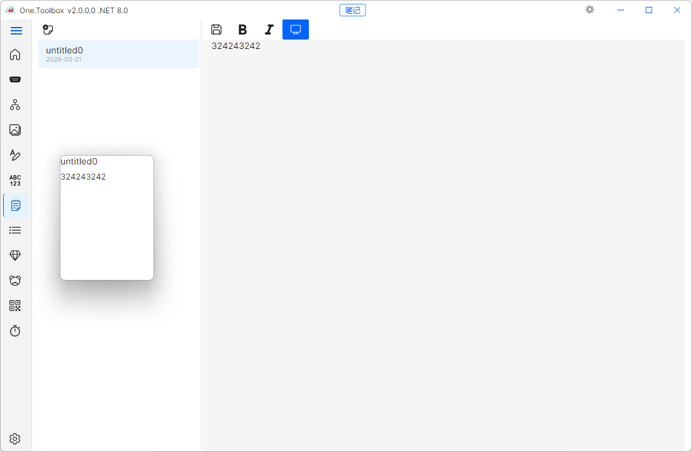
  <p>笔记管理界面</p>
</div>

### 待办事项
**功能说明：** 简单高效的待办事项管理工具。

**核心功能点：**
- 任务添加与编辑
- 优先级设置
- 完成状态跟踪
- 分类管理

**界面截图：**

<div align="center">
  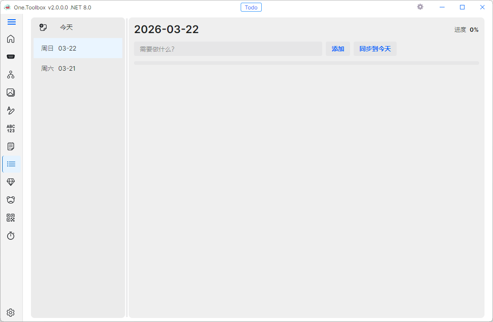
  <p>待办事项界面</p>
</div>

### 哈希工具
**功能说明：** 计算文件或文本的哈希值，支持多种算法。

**核心功能点：**
- 支持MD5、SHA1、SHA256、SHA512等算法
- 文本哈希计算
- 文件哈希计算
- 哈希值比较

**界面截图：**

<div align="center">
  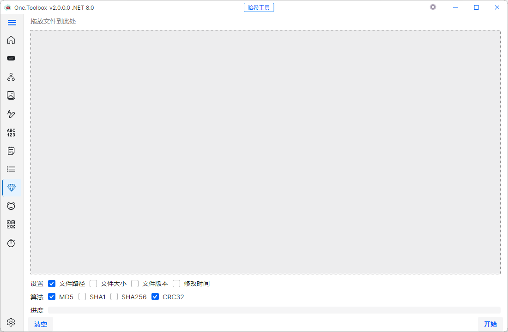
  <p>哈希工具界面</p>
</div>

### 正则表达式测试
**功能说明：** 实时测试正则表达式的匹配效果。

**核心功能点：**
- 实时正则表达式匹配
- 匹配结果高亮显示
- 支持常用正则表达式模板
- 正则表达式语法提示

**界面截图：**

<div align="center">
  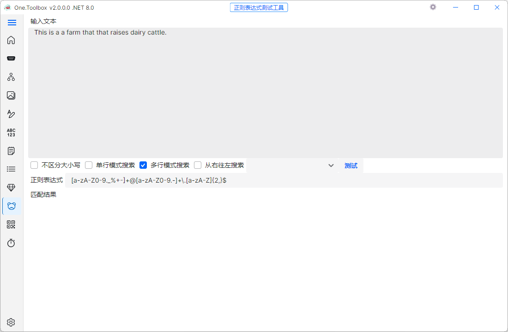
  <p>正则表达式测试工具界面</p>
</div>

### 二维码生成
**功能说明：** 生成和识别二维码。

**核心功能点：**
- 文本转二维码
- 二维码图片生成与保存
- 支持自定义二维码大小和颜色

**界面截图：**

<div align="center">
  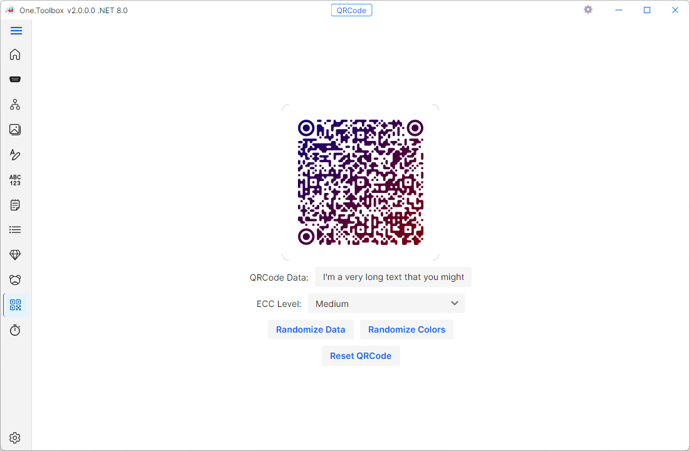
  <p>二维码生成工具界面</p>
</div>

### Unix时间转换
**功能说明：** 在Unix时间戳和人类可读时间之间进行转换。

**核心功能点：**
- Unix时间戳转日期时间
- 日期时间转Unix时间戳
- 支持毫秒级时间戳

**界面截图：**

<div align="center">
  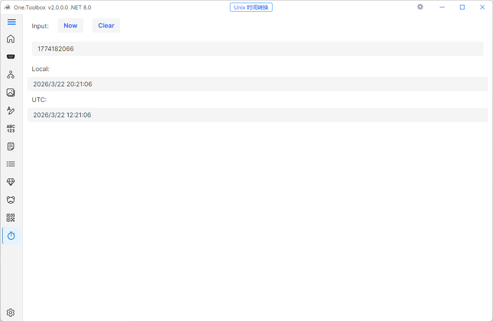
  <p>Unix时间转换工具界面</p>
</div>

### Bing图片浏览
**功能说明：** 浏览Bing每日图片，并设置为桌面背景。

**核心功能点：**
- 查看每日Bing图片
- 图片详情信息展示
- 设置为桌面背景
- 图片下载

**界面截图：**

<div align="center">
  
  <p>Bing图片浏览工具界面</p>
</div>

## 🌟 项目优势

### 技术实现上的创新点
- 基于Avalonia框架实现真正的跨平台支持
- 采用MVVM架构，确保代码的可维护性和可测试性
- 模块化设计，便于扩展和定制
- 按需加载机制，提高启动速度和运行效率

### 性能或效率方面的优势
- 轻量级设计，占用资源少
- 异步处理机制，确保UI响应流畅
- 高效的数据处理算法
- 优化的内存管理

### 用户体验上的优化
- 现代化的用户界面设计
- 直观的操作流程
- 支持主题切换（深色/浅色）
- 多语言支持
- 响应式布局，适配不同屏幕尺寸

### 与同类项目的对比分析
| 特性 | Avalonia.One | 传统单一功能工具 | 商业工具套件 |
|------|-------------|----------------|-------------|
| 跨平台支持 | ✅ 全平台 | ❌ 通常单平台 | ⚠️ 部分支持 |
| 功能集成度 | ✅ 高度集成 | ❌ 单一功能 | ✅ 高度集成 |
| 轻量化 | ✅ 轻量级 | ✅ 轻量级 | ❌ 资源占用大 |
| 开源免费 | ✅ 开源免费 | ❌ 部分收费 | ❌ 收费 |
| 可扩展性 | ✅ 模块化扩展 | ❌ 难以扩展 | ⚠️ 有限扩展 |
| 用户体验 | ✅ 现代化UI | ❌ 传统UI | ✅ 良好但复杂 |

## 🚀 快速开始

### 本地构建

1. 克隆仓库：
```bash
git clone https://github.com/yourusername/Avalonia.One.git
cd Avalonia.One
```

2. 还原依赖：
```bash
dotnet restore
```

3. 构建项目：
```bash
dotnet build Avalonia.One.sln -c Debug
```

4. 运行应用：
```bash
dotnet run --project One.Toolbox.Desktop/One.Toolbox.Desktop.csproj
```

### 运行测试

```bash
dotnet test One.Base.Tests/One.Base.Tests.csproj -c Debug
```

### 发布

GitHub Actions 工作流位于 `.github/workflows/dotnet-desktop.yml`，触发条件为 `v*.*.*` tag。

## 🤝 贡献指南

欢迎对项目提出建议和贡献代码！

1. Fork 仓库
2. 创建特性分支 (`git checkout -b feature/AmazingFeature`)
3. 提交更改 (`git commit -m 'Add some AmazingFeature'`)
4. 推送到分支 (`git push origin feature/AmazingFeature`)
5. 打开 Pull Request

## 📝 作者信息

**Kevin Bran**
- GitHub: [@KevinBran](https://github.com/KevinBran)
- 博客: [https://www.cnblogs.com/KevinBran](https://www.cnblogs.com/KevinBran)
- 邮箱: your.email@example.com

## 📄 许可证

本项目采用 MIT 许可证 - 查看 [LICENSE](LICENSE) 文件了解详情

## 🙏 致谢

- [Avalonia](https://avaloniaui.net/) - 跨平台UI框架
- [MVVM Toolkit](https://learn.microsoft.com/en-us/dotnet/communitytoolkit/mvvm/)
- [.NET Foundation](https://dotnetfoundation.org/)

---

**如果您喜欢这个项目，请给它一个 ⭐ 支持一下！**
